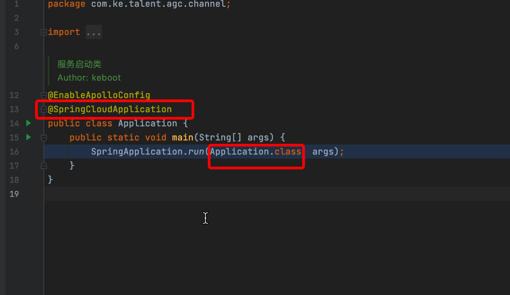
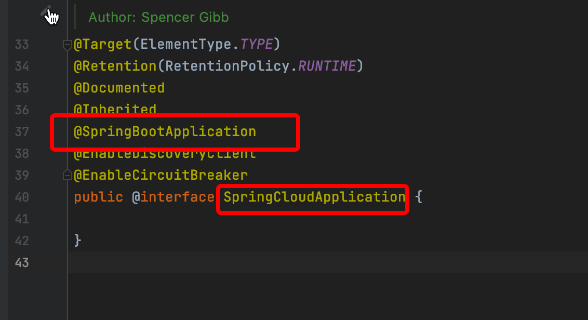
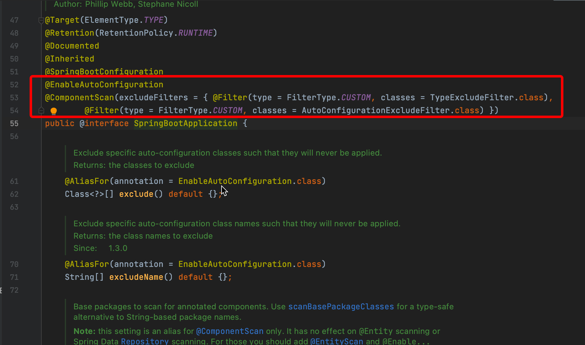
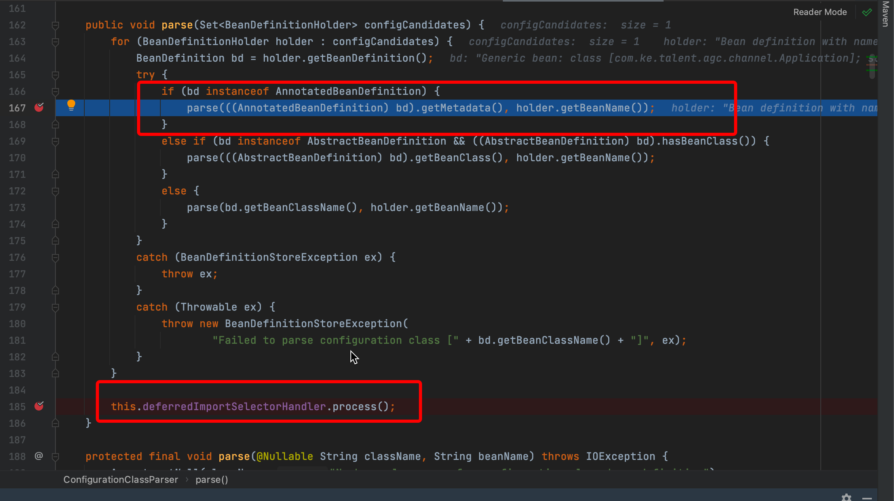

## 自动装配的机制

自动装配在Spring Boot中非常重要，是Spring Boot starters的基石，本文将从一个业务问题解析自动装配的机制。

先说结论：

Spring Boot项目bean注册顺序

1. 启动类(一般是被@SpringBootApplication注解的类)以及其包下的bean

2. 自动装配的bean

   如果有多个自动装配的类，按如下顺序

   1. 先通过字母顺序排序
   2. 在通过定义的order顺序排序(参见@AutoConfigureOrder)
   3. 在通过@AutoConfigureBefore @AutoConfigureAfter排序

根据该顺序，再结合@ConditionalOnMissingBean，@ConditionalOnMissingClass等条件注解，即可完成自动装配，达到约定大于配置的效果。

最近业务同学反馈了一个这样的问题

> org.springframework.beans.factory.support.BeanDefinitionOverrideException: Invalid bean definition with name 'methodValidationPostProcessor' defined in class path resource [com/ke/talent/common/rest/config/ValidatorConfiguration.class]: Cannot register bean definition [Root bean: class [null]; scope=; abstract=false; lazyInit=false; autowireMode=3; dependencyCheck=0; autowireCandidate=true; primary=false; factoryBeanName=validatorConfiguration; factoryMethodName=methodValidationPostProcessor; initMethodName=null; destroyMethodName=(inferred); defined in class path resource [com/ke/talent/common/rest/config/ValidatorConfiguration.class]] for bean 'methodValidationPostProcessor': <font color="#dd0000" size="5">There is already</font> [Root bean: class [org.springframework.boot.autoconfigure.validation.ValidationAutoConfiguration]; scope=; abstract=false; lazyInit=false; autowireMode=3; dependencyCheck=0; autowireCandidate=true; primary=false; factoryBeanName=null; factoryMethodName=methodValidationPostProcessor; initMethodName=null; destroyMethodName=(inferred); defined in class path resource [org/springframework/boot/autoconfigure/validation/ValidationAutoConfiguration.class]] bound.
>
> //省略若干日志
> Consider renaming one of the beans or enabling overriding by setting spring.main.allow-bean-definition-overriding=true


上述日志显示，com.ke.talent.common.rest.config包下的ValidatorConfiguration.class中定义了一个bean，和Spring Boot自动装配中的bean发生了bean定义冲突。

```java
package com.ke.talent.common.rest.config;
//省略若干代码
mv
@Configuration
public class ValidatorConfiguration {
//省略若干代码
    @Bean
    public MethodValidationPostProcessor methodValidationPostProcessor() {
        MethodValidationPostProcessor postProcessor = new MethodValidationPostProcessor();
        postProcessor.setValidator(this.validator());
        return postProcessor;
    }
}
```


第一直觉是，Spring Boot自动装配不是有一个@ConditionalOnMissingBean条件吗，如下所示，在org.springframework.boot.autoconfigure.validation包下查看ValidationAutoConfiguration类。

```java
@Bean
@ConditionalOnMissingBean
public static MethodValidationPostProcessor methodValidationPostProcessor(Environment environment,
                                                                          @Lazy Validator validator) {
  MethodValidationPostProcessor processor = new MethodValidationPostProcessor();
  boolean proxyTargetClass = environment.getProperty("spring.aop.proxy-target-class", Boolean.class, true);
  processor.setProxyTargetClass(proxyTargetClass);
  processor.setValidator(validator);
  return processor;
}
```

正常来说，如果我们已经在应用中配置了MethodValidationPostProcessor类型的bean，那么上述代码所定义的bean就不会再被注册。

查阅@ConditionalOnMissingBean的java doc

> The condition can only match the bean definitions that have been processed by the application context so far and, as such, it is strongly recommended to use this condition on auto-configuration classes only. If a candidate bean may be created by another auto-configuration, make sure that the one using this condition runs after.
>
> 译文：该条件只能匹配到目前为止已由应用程序上下文处理的 bean 定义，因此，强烈建议仅在自动配置类上使用此条件。 如果候选 bean 可能是由另一个自动配置创建的，请确保使用此条件的那个 bean 之后运行。

简而言之，要想@ConditionalOnMissingBean生效，被@ConditionalOnMissingBean注解的bean必须是后注册的

<font color="#dd0000">但根据上述报错表明，实际情况是Spring Boot自动装配的bean先注册了，之后Spring才扫描到com.ke.talent.common.rest.config包下的ValidatorConfiguration.class，而ValidatorConfiguration中的bean定义没有任何条件注解，且类型和名称都与Spring Boot自动装配的bean相同，因此提示bean重复定义的异常</font>

为什么会出现这样的情况？

经过调查，发现com.ke.talent.common.rest.config.ValidatorConfiguration也是通过自动装配注入的


那么两个自动装配的bean的加载顺序是怎么决定的呢？通过debug，阅读源码发现此处决定了自动装配的顺序org.springframework.boot.autoconfigure.AutoConfigurationSorter#getInPriorityOrder

```java
	public List<String> getInPriorityOrder(Collection<String> classNames) {
		AutoConfigurationClasses classes = new AutoConfigurationClasses(this.metadataReaderFactory,
				this.autoConfigurationMetadata, classNames);
		List<String> orderedClassNames = new ArrayList<>(classNames);
		// Initially sort alphabetically
		Collections.sort(orderedClassNames);
		// Then sort by order
		orderedClassNames.sort((o1, o2) -> {
			int i1 = classes.get(o1).getOrder();
			int i2 = classes.get(o2).getOrder();
			return Integer.compare(i1, i2);
		});
		// Then respect @AutoConfigureBefore @AutoConfigureAfter
		orderedClassNames = sortByAnnotation(classes, orderedClassNames);
		return orderedClassNames;
	}
```

1. 先通过字母顺序排序
2. 再通过定义的order顺序排序(参见@AutoConfigureOrder)
3. 再通过@AutoConfigureBefore @AutoConfigureAfter排序

经过这样的排序后，org.springframework.boot.autoconfigure.validation.ValidationAutoConfiguration排在了com.ke.talent.common.rest.TalentRestConfiguration前面，以上。

因此提供三方包的同学应该注意了，必须避免这种冲突，方案可以是下述之一

* 提供组件，但让业务方自己在项目中显式注册
* 如果真的想用自己的自动装配覆盖Spring Boot的自动装配，可以通过上面的排序规则，让自己的自动装配class排到Spring Boot提供的自动装配class前面。


接下来继续讨论，为什么我们平时写在项目中的bean定义，就可以覆盖Spring Boot自动装配的bean定义呢？是什么保证了我们写在项目中的bean在自动装配的bean之前注册呢？

这个需要从启动类开始分析，如下




SpringApplication将Application这个类作为参数传入，而这个类上有一个@SpringCloudApplication注解，继续追踪该注解，发现其元注解包括






注意这两个元注解

* @ComponentScan(excludeFilters = { @Filter(type = FilterType.CUSTOM, classes = TypeExcludeFilter.class),
        @Filter(type = FilterType.CUSTOM, classes = AutoConfigurationExcludeFilter.class) })

  该注解在没有指定扫描的包的情况下，会将被注解类的包路径作为扫描的包

* @Import(AutoConfigurationImportSelector.class)

  该注解会扫描自动装配的bean

Debug，阅读源码，找到核心代码段org.springframework.context.annotation.ConfigurationClassParser#parse(java.util.Set<org.springframework.beans.factory.config.BeanDefinitionHolder>)



由于代码逻辑还是比较多的，这里不再展开，仅说明这两处代码做了什么事情。

* 167行代码，解析Application类
  * 解析发现@ComponentScan，扫描注册Application类对应的包路径的bean
  * 解析发现@Import(AutoConfigurationImportSelector.class)，初始化185行的deferredImportSelectorHandler
* 185行代码，deferredImportSelectorHandler中的AutoConfigurationImportSelector会执行自动装配的逻辑，从META-INF/spring.factories下找到需要自动装配的bean

此处代码决定了Application包目录下的bean注册早于自动装配的bean，以上。