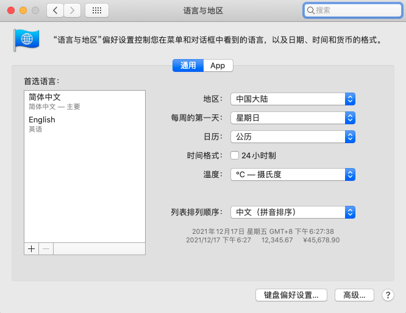

#### java locale 编码问题

java编码问题其实分为很多种，比如jvm默认locale设置，默认文件编码方式设置，日志编码设置，源文件编码设置，本文档持续更新所有的编码相关问题

* 影响locale，文件编码的jvm属性

  * user.language

  * user.country

  * user.variant

    这个我们一般不关心

  * file.encoding

  这几个属性，首先jvm会通过复杂的逻辑进行初始化，这部分c代码详见openjdk：System.c，java_props_md.c，java_props_macosx.c，该部分逻辑，在不同的平台会有不同，绝不是仅仅通过LANG，LC_ALL，LC_*，LANGUAGE环境变量决定的，由于逻辑较为复杂，而我的clion过期了，因此我也没有debug详细跟踪一下。

  如果不想受系统环境影响，或者不想探究其影响逻辑的话，可以直接在jvm参数中指定上述属性的值，从而在初始化逻辑中覆盖之前得到的值。这其实是最简单高效的方法。

* macos

  根据首选语言和地区，user.language=zh，user.country=CN，文件编码通过什么影响的我没有找到

  

* Debian

  Debian容器环境下，如果在dockerfile中指定下述命令

  ```dockerfile
  # Debian 先安装locales
  RUN apt-get update
  RUN apt-get -y install locales
  
  
  RUN sed -i '/zh_CN.UTF-8/s/^# //g' /etc/locale.gen && \
      locale-gen
  ENV LC_ALL zh_CN.UTF-8
  ```

  得到下述结果，上述命令确实可以完全影响到我们需要的几个属性，但要注意的是，zh_CN.UTF-8这个值必须是locale支持的，不然会得到意想不到的结果，可以查看/etc/locale.gen文件得到支持的值(这个文件中的值是否齐全我不清楚，也没有去搜索相关文档)。

  ```java
  使用下述代码输出
  System.out.println("user.language=" + System.getProperty("user.language"));
  System.out.println("user.country=" + System.getProperty("user.country"));
  System.out.println("file.encoding=" + System.getProperty("file.encoding"));
  System.out.println("default locale=" + Locale.getDefault());
  ```

  ```properties
  user.language=zh
  user.country=CN
  file.encoding=UTF-8
  default locale=zh_CN
  ```

* Centos7

  Centos7容器环境下，则需要在dockerfile中指定下述命令

  ```dockerfile
  RUN localedef -c -f EUC-TW -i zh_TW zh_TW.EUC-TW
  ENV LC_ALL zh_TW.EUC-TW
  ```

  ```properties
  user.language=zh
  user.country=TW
  file.encoding=EUC-TW
  default locale=zh_TW
  ```

#### 网上流言

https://jarirajari.wordpress.com/2020/11/23/how-to-set-locale-in-linux-for-jvm/

> 1. If the JVM setting `user.language` is set, use it and look no further
> 2. If user language is not set, scan the environment for `LC_ALL`
> 3. If `LC_ALL` does not exist, scan the environment for `LANG`
> 4. If `LANG` is not set, default to `en_US` locale

以上述文章为例，其列举了环境变量的优先级，但这和java应用的实际运行情况显然是不匹配的。