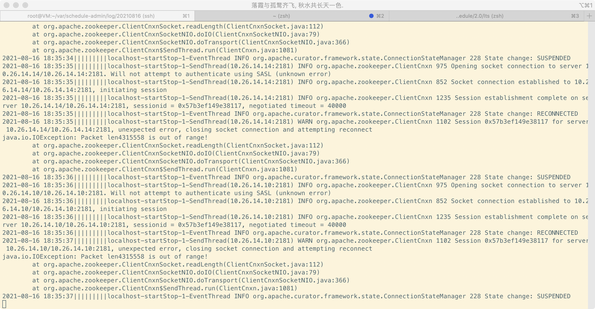

#### 问题

近期测试环境的zookeeper出现了out of memory异常。种种迹象表明是l-schedule（基于阿里lts）导致。

由于线上依赖zookeeper的服务非常多，因此需要尽快定位引发zookeeper oom的问题，以免最终在线上导致同样的问题。

#### 先说结论

Admin系统触发了zookeeper的bug，触发条件如下

1. 重试次数非常大
2. 开启监听
3. 获取数据时，数据包大小超过了jute.maxbuffer,默认值4m

zookeeper在3.6.0修复了此bug，pr：https://github.com/apache/zookeeper/pull/590

这里说下内存泄露主要原理：

客户端使用长连接开启监听，同时该长连接也会用于其他的读写操作。在代码3处，客户端读取的数据包太大，引发io异常，并关闭了连接。客户端关闭连接后，zookeeper在添加watch的时候，没有检测该连接是否有效，将已经无效的连接添加，并且后续没有移除无效连接的操作，造成永久的引用，该连接自然会进入到老年代，且无法被回收，而该连接中引用了一个大于4m的数据。同时，客户端由于设置了非常大的重试次数，会继续新创建连接进行操作，但数据包大小是固定的，因此每次都会发生io异常并在此重试，导致持续的内存泄露，最终导致zookeeper oom而宕机。

#### 排查过程

在l-schedule的架构中，Admin，JobClient，JobTracker，TaskTracker，业务方Spring Boot自动装配SDK都会和zookeeper交互。如果是某一业务方使用SDK引起的问题，就会非常难以排查。

先排查server端Admin，JobClient，JobTracker有没有问题。这几个服务恰好都部署在一个服务器

经过一番排查，发现了一些蛛丝马迹

* 通过使用netstat -anlpt | grep 2181发现有一个进程频繁创建和销毁连接，通过pid定位到是admin服务

* admin服务的日志出现了如下情况，这是Curator-Framework抛出的异常，没有见到项目代码的异常

  

  日志显示，数据包超过了4m，是什么地方存储了这么大的数据呢？查看了一下代码，没有找到。

* zk的watch数目明显上升

* 查看zk oom后的内存快照

  dominator retained heap排序

  

  或者histogram中查看retained heap排序，但是这个的计算很慢

  

  retained size排序是分析内存泄露的利器。

查看代码，怀疑频繁创建连接是因为发生了上述异常导致连接关闭，而zk客户端重试次数设置为最大值，一直重试又会新建连接。由于一直重试，项目代码不会抛出异常。基于此思路，写了测试代码，果然如此。

接下来的问题是，到底是什么项目代码导致了这种行为呢？可以将重试次数调小，重试结束后，自然就会抛出异常，但出于一些原因，没有这么做。考虑到重试次数非常大，项目代码运行的线程必然长时间卡在重试的位置，因此使用jstack dump下线程快照，就定位到了问题代码。代码显示，是在读取列表的时候，数据包过大了，这就破案了，项目代码往某个节点下增加子节点，是一个一个增加的，但获取子节点列表的时候，超过了4m。

至此，客户端的问题就定位完毕。仔细想想，有点不对劲啊？客户端虽然出现异常，但通过netstat发现连接已经释放，可以认为客户端已经正确处理了该连接，为啥zk server端却oom了？因此这个问题本质上是zk的内存泄露问题。

在本地复现问题后，通过尝试不同版本的zk，发现zk 3.6.0以及更高版本解决了问题。查阅release note，实在太多修复了，真的是没有找到哪个链接对应这个bug！因为zk也是用java写的，我就想通过debug的方式来确认下是哪部分代码出了问题。查看zk的启动脚本，在jvm参数中开启端口，然后就开始debug zk，功夫不负有心人，最终找到了出问题的代码，并且根据该部分代码找到git的提交记录，最终得到了修复的pr连接。