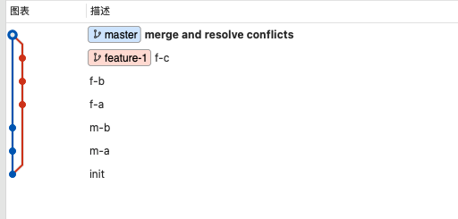

### 使用git rebase 合并代码

#### 场景和问题

当前应用开发中，git可谓是不可或缺的一个版本管理工具。
这次我们要介绍的两个命令是merge和rebase，这两个命令都可以合并commit，那么他们有什么区别呢，日常使用中，应该如何选择？有什么注意事项呢?

一图胜千言，使用merge,你得到的git提交历史是这样的

 

使用rebase，git历史是这样的

 

另外，我们开发一个feature，不太可能所有的代码都开发完，只提交一个commit，通常我们是这么开发的

 

我们希望该分支在merge到master前，压缩成一个commit，这个时候，需要用rebase。

#### 实战

##### 1. 使用git rebase进行合并

接下来，我们从实战出发，看下如何使用rebase完成一次feature的合并。

如下图，有两个分支，master和feature-1

 

* 第一步   首先压缩成一个commit

  git rebase  -i [commit-id] 这里填init对应的commit id或者HEAD~3，表示当前节点往前推3个节点

  

  根据这里的提示，可以选择是否修改提交信息，将pick替换成如下

  

  保存，然后就合并完毕了

   

  > git reset也可以实现压缩commit，但是却无法利用之前的commit message，并且方式有些风险且过于hack，因此本文不再展开。

* 第二步  再使用rebase merge到master

  git rebase master

   

  在实际的使用中，绝大多数情况可以忽略第一步，直接执行第二步，如果没有冲突，或者冲突比较好解决，我们可以很快速的合并，当遇到复杂的冲突问题时，可以分成这两步去做。

##### 2. 使用git merge进行合并

 

#### 注意事项
永远不要将公共分支rebase到私有的分支上。
私有分支rebase后,推送远程可能需要force

关于rebase和merge更深入的文章，可以参考

https://www.atlassian.com/git/tutorials/merging-vs-rebasing

