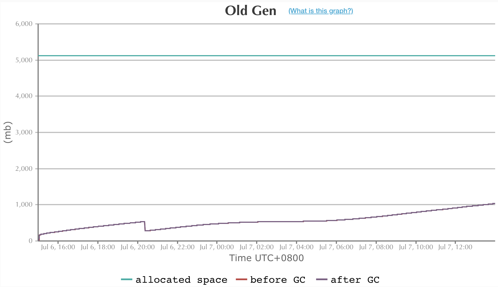
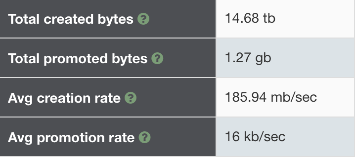

# 史诗级java低时延调优案例1
<p style="text-align:right"><span style="font-size: medium; ">-- 西门幽月</span></p>

### 序章
生产环境调优往往是一件复杂又痛苦的事，互联网公司尤其严重，主要表现在
* 人员流动大，工程师往往负责的是别人留下的代码
* 单个服务内部逻辑混乱，补丁繁多
* 服务之间依赖纠缠不清
* 服务分布式部署

近期作者刚好遇到了一个问题，由于排查此问题涉及

> hystrix,链路追踪,分布式服务日志搜索,http,gc,thread pool,c3p0 connection pool,jdbc驱动,netty nio,cache,finalizer,Memory Aanlysis Tool,jvisualvm,yourkit

等诸多技术和工具，个人认为是一个非常好的复杂问题排查的示例。

作者并非意图借此文传达问题的解决方案。而是希望引领读者能探索出自己解决问题的思路，因此正文将采用问答式行文。

>另外，本文也指出了国内技术网站上某些非常常见的错误结论，由于cv大法(copy and paste)盛行的原因，那些错误流传甚广。任何从事高并发编程的工程师都应该避免那些常见错误。
>
>本文的相关链接和未出现在文中但在排查问题过程中参考的文章都会在文末给出，方便读者后续研读

### 第一章 源于告警
最近收到告警显示，某接口偶尔有超时情况，该接口调用链路复杂，从日志作为出发点去分析有种无从着力之感，好在最近刚部署了[skywalking]([https://skywalking.apache.org/zh/](https://skywalking.apache.org/zh/))，通过可视化页面可看到调用链路的耗时情况。

> skywalking是Apache下的链路追踪工具


>上图左方是接口名，右方横线表示执行开始至结束的时间。

从上图可以一目了然的看出，a接口超时，是因为调用b接口引起。接下来通过traceId分析日志，当时的情况是，ab项目都接入了skywalking，但是b项目没有打印traceId；b项目是分布式部署的，但没有使用elk收集日志。

* 如何通过上述调用信息，知道此次调用路由到b接口对应服务的哪台机器？
通过时间戳去筛查日志显然不是一个好主意，尤其是在日志量非常大的情况下。虽然b没有接入skywalking，但是项目之间使用http协议进行交互，traceid将会通过http协议的header传给b。b中只要打印下请求的header即可。通过研究skywalking源码可知header名称，或者可以通过日志去大致推断。最终得到，traceid会使用base64编码后在header中传递。
* b项目没有接入elk，如何搜索日志，要在所有机器挨个搜索吗？
作者写了个python脚本，使用多线程执行ssh远程命令，并将命令的stdout重定向到当前程序的stdout(控制台)，临时解决了此问题。
> 感悟:
>
> 日志是最重要的技术之一，先把日志系统做好，才能避免996

### 第二章 心不唤物物不至，问题终于浮出水面
请求方使用的是Apache httpClient库，处理方使用公司自研框架，底层使用netty处理http协议。

* 从图中看出，a接口发出请求后，一段时间后b才开始执行，这个时间差是什么原因导致的？
通过日志确认，请求方提交请求时间和图中链路开始时间一致。http库一般都配置了连接池，因此请求提交后可能排队。netty收到完整报文并真正执行也需要时间。

因此问题转换为：

* a中的hystrix任务是否在线程池队列中排队？
hystrix-dashboard提供线程池实时状态查看，查看时并不繁忙，没有任务在队列中，但不排除发生超时事件时恰巧出现了排队情况。
* a中的httpClient请求是否在线程池队列中排队？
没有类似hystrix-dashboard的工具可以看线程池情况，但可以借助一些其他工具。作者猜测jmx也许可以，但并没有去研究。
* b中的netty eventloop是否出现排队情况
通过查看自研框架代码，发现框架使用bossGroup，workerGroup两个线程池。workerGroup线程进行非阻塞读写的同时还要处理任务，一旦任务阻塞，则会出现请求排队的情况。这个不太合理的设计可能是个突破口。继续查看代码`private int workerThreadSize = Runtime.getRuntime().availableProcessors() * 2 - 1;`登录服务器查看cpu信息，2个cpu，每个12核心，每个核心2个超线程，共48个逻辑processors，那么workerGroup的线程数为48*2-1=95，实际上非常多，因此排队的情况也不太可能出现。

由于没有足够的信息分析上述情况，因此暂时放弃从此方向探索。
>更深入的思考:
>也可以查看skywalking源码，确认hystrix和httpclient记录起始时间。

使用`grep "xxxx-xx-xx xx:xx:xx" full.log > simple.log`命令导出临近时间的日志。由于作者只关注超时请求的日志，因此花费了大量时间却什么都没有发现。直到作者想查看b执行任务之前发生了什么的时候，意外发现，有将近4s的时间没有打印任何日志，这和图中超时时间吻合。该服务24小时都有大量流量，不应该出现这种情况，除非发生了gc，也就是stop the world。

```
1074370.765: [GC (CMS Final Remark) [YG occupancy: 1161721 K (2831168 K)]1074370.765: [Rescan (parallel) , 0.0282716 secs]1074370.793: [weak refs processing, 3.9080203 secs]1074374.701: [class unloading, 0.0895909 secs]1074374.791: [scrub symbol table, 0.0193149 secs]1074374.810: [scrub string table, 0.0073974 secs][1 CMS-remark: 4456982K(5242880K)] 5618704K(8074048K), 4.0599904 secs] [Times: user=3.06 sys=1.86, real=4.06 secs]
```

> 感悟:
>
> 问题总是偶然发现的，但它似乎听到了你的呼唤。

### 第三章 问题已经解决？

* 使用的垃圾回收器是？

  UseParNewGC + UseConcMarkSweepGC

* 这个日志的时间戳有什么问题吗？

  这个日志使用的时间戳是当前时间和应用启动时间的差值，非常不便于排查问题，后续将添加-XX:+PrintGCDateStamps参数打印日期格式的时间戳。

* 这个日志反映了gc的什么情况？

  细心的同事从gc日志看出，weak refs processing使用了相当多的时间。作者推断WeakReference往往用于缓存。可能该问题是应用程序中的缓存导致的。(但weak refs processing真的是处理WeakReference吗？)

  >更深入的思考：
  >
  >* WeakRefrence的引用对象何时被回收？
  >
  >  参考[WeakRefrence and gc](https://blogs.oracle.com/poonam/weakreferences-and-gc)，WeakRefrence引用的对象没有其他强引用时，如果发生了gc会被回收。很多文章错误地认为一旦发生gc，WeakRefrence的引用对象就会被回收。
  
* 得到了什么处理方案？

  本地缓存是正常代码，无法去除，尝试添加-XX:+ParallelRefProcEnabled并行处理引用，节省时间。请读者注意，不要将此参数作为救命稻草，而忽略了真正的问题。

* 还有其他的措施吗？

  为了获取更详细的gc信息，作者添加了更多打印gc日志的参数，从现在来看当时这个操作，是非常有意义的。另外请注意最后一个参数，原来最大年龄阈值为6，现改为15。作者本是希望减少晋升到老年代的对象，没想到无心插柳柳成荫，此事后文会继续讨论。

  ```
  -XX:+PrintReferenceGC
  -XX:+PrintHeapAtGC
  -XX:+PrintGCDetails
  -XX:+PrintGCDateStamps
  -XX:+PrintGC
  -XX:+PrintAdaptiveSizePolicy
  -XX:+PrintGCDateStamps
  -XX:+PrintGCDetails
  -XX:+PrintTenuringDistribution
  -XX:MaxTenuringThreshold=15
  ```

此时有更充分的日志了，一天后，再次查看full gc

```
2020-07-06T13:41:27.510+0800: 98027.086: [GC (CMS Final Remark) [YG occupancy: 1143054 K (2831168 K)]2020-07-06T13:41:27.511+0800: 98027.086: [Rescan (parallel) , 0.1128933 secs]2020-07-06T13:41:27.624+0800: 98027.199: [weak refs processing2020-07-06T13:41:27.624+0800: 98027.199: [SoftReference, 1487 refs, 0.0040026 secs]2020-07-06T13:41:27.628+0800: 98027.203: [WeakReference, 15243 refs, 0.0061822 secs]2020-07-06T13:41:27.634+0800: 98027.209: [FinalReference, 45882 refs, 0.3683047 secs]2020-07-06T13:41:28.002+0800: 98027.578: [PhantomReference, 0 refs, 1 refs, 0.0032547 secs]2020-07-06T13:41:28.005+0800: 98027.581: [JNI Weak Reference, 0.0000793 secs], 0.3819463 secs]2020-07-06T13:41:28.005+0800: 98027.581: [class unloading, 0.1211467 secs]2020-07-06T13:41:28.127+0800: 98027.702: [scrub symbol table, 0.0214804 secs]2020-07-06T13:41:28.148+0800: 98027.724: [scrub string table, 0.0116539 secs][1 CMS-remark: 4457263K(5242880K)] 5600318K(8074048K), 0.6552275 secs] [Times: user=11.70 sys=3.07, real=0.65 secs] 
```

* -XX:+ParallelRefProcEnabled有效果吗？

  有很大的效果。使用

  > java -XX:+UseConcMarkSweepGC -XX:+PrintFlagsFinal | grep ParallelGCThreads

  命令查看并发执行的线程数目为33，由于实际核心数目为24(超线程后为48)，不妨按24计算，如果原来的情况gc还是3.9080203s的话，粗略计算，时间应该会下降至3.908/24=0.1628s，此处FinalReference 处理时间为0.3683047s。因为无法得知此次gc在没有-XX:+ParallelRefProcEnabled参数下会是多久，但从数量级上来看，这个数据是基本合理的。

* weak refs processing是指WeakReference处理吗？

  不！显然，weak refs processing包含了SoftReference，WeakReference，FinalReference，PhantomReference，JNI Weak Reference。而最耗时的是FinalReference。

* FinalReference是什么？

  当时作者没有给与足够关注，后文会继续谈论此问题。如果早点关注到此类，会让后续的探索更加坚定。

  > 对于作者来说，并不缺乏坚定的信念，因此这不会导致问题。但是对于意志不够坚定的人来说，可能会导致后续的探索无法完成。

* 问题解决了吗？

  没有。这个优化已经非常大，老年代回收650ms时间不长，但差强人意。即使不继续探究也无可厚非。但以作者的性格来讲，这个问题没有解决。

>感悟：既然做，就拼尽全力做到最好。

### 第四章 大海捞针

根据上面讲到的gc日志，发现最耗时的是FinalReference。由于当时作者对此认知不足，没有第一时间查此问题，导致走了不少弯路，这里麻烦读者一起重走一趟弯路。

* 主要问题是cms remark耗时过长，手头的资源是gc日志，有什么更好的办法去排查问题吗？

  先想想是否有一些可视化的工具，作者使用的是[easygc](https://gceasy.io/)

  

* 老年代增长速度正常吗？

  作者也无法确定其增长速度是否正常，但很想知道是什么对象在不断晋升到老年代，以下是作者服务的一些情况。

  * 作者的服务是web服务，并不维护用户状态。
  * 缓存主要使用redis，也使用了少量本地缓存。

* 下一步朝什么方向探索？

  由于线上环境不方便dump内存快照，因此先尝试分析测试环境内存快照。

* 分析内存快照面临的主要的难题是什么？

  这对作者来说是一个比较陌生的领域，而相关文章多是分析内存泄露。作者想知道什么对象在不断晋升到老年代。此文给了作者一些启发，[How do I find what's getting promoted to my old generation?](https://blogs.oracle.com/poonam/how-do-i-find-whats-getting-promoted-to-my-old-generation)

  > 上述文章使作者明白object id是对象在jvm内存中的地址。

* 使用什么工具分析

  作者首先使用java自带的jvisualvm，在使用oql查询语言时发现和网上部分文章介绍的语法不兼容，后改用eclipse的Memory Aanlysis Tool(简称mat)，后来也使用了yourkit(收费,15天试用期)。工具各有优缺点。

使用jvisualvm装载快照后，根据大小和保留大小排序，完全看不到任何线索。作者迷失在了各种对象堆砌而成的汪洋大海中。

> 类总数有21,274个。


> 人是有惰性的，作者也如此。作者使用过多次jvisualvm，因此并不想尝试使用mat。后来在使用过程中发现mat的shallow heap,retained heap与jvisualvm的shallow size(大小)和retained size(保留)值差距很大，不知道是不是兼容性问题。但是mat的数据对作者更有用。最终也是通过mat确定了问题。使用mat需要注意打开preferences -> Memory Aanlysis -> keep unreacheable objects。

以下是mat的dominator_tree。

> 该视图展示实例对象的各项指标


可以看到保留空间最大的是Finalizer对象

* Finalizer对象是什么？

  Finalizer是上文中提到的FinalReference的子类。

>更深入的思考：
>
>当一个类(以下称为a)覆写了Object的finalize方法，且该方法不为空方法。那么在a创建过程中。还会同时创建一个Finalizer对象，Finalizer对象会维护一个指向a的引用。当发生gc(包括老年代gc)时，垃圾收集器会检查除Finalizer对象引用a外是否还有其他引用指向a。如果没有，则将Finalizer对象加入x队列，并通过FinalizerThread异步执行Finalizer引用的a对象的finalize方法。执行完毕后移除x队列。此时a的所有引用均不可达，可以对a进行回收。
>
>* 可以看出，覆写Object的finalize方法且方法不为空的类的实例，至少需要两次gc才能回收，第一次gc后只能先入队，为什么需要先入队呢？
>
>   因为执行finalize需要时间，如果在gc中执行这部分代码会让gc的时间变得更长且不可控。
>
>* 很多文章说FinalizerThread优先级低，是这样吗？
>
>   不一定，作者使用的jdk中FinalizerThread优先级为8，比普通线程优先级5高。更何况即使优先级低，只要cpu负载不高，也能分到足够的cpu时间片执行任务。作者在堆快照中看到，x队列为空。
>
>* jdk为什么设计Finalizer类
>
>   有一类对象，需要通过调用api的方式宣告其生命的结束，如Socket对象需要调用close方法(持有Tcp连接资源的对象往往都是这样的)。这类对象的引用被gc了，不代表底层的资源释放了。为了解决用户忘记调用释放资源的api而导致的资源泄露问题，设计了Finalizer类
>
>* 需要设计这个Finalizer类吗？
>
>   这是个哲学问题，如果你认为底层资源的释放也属于gc的范畴，那么应该设计这个类。如果你认为底层资源的释放是jdk用户应该考虑的问题，那么不应该设计这个类。但是这个设计被认为是糟糕的设计，并在jdk9废弃，但问题没有解决。本质上来说，所有引用释放后，资源也要释放，但是资源释放需要时间，若在gc中释放资源会导致gc时间变长。因此资源的释放总是需要异步去处理的。
>
>* Finalizer机制可以避免用户忘记资源释放，是否可以用来保证分布式锁的释放？
>
>   放弃这个想法。
>
>* Finalizer机制还有其他缺点吗？
>
>   很多，可参考*Effective Java*
>
>笔者也试用了yourkit，其中有统计实现finalize的类的实例数的功能。

* 在作者的系统中，Finalizer都引用了哪些类

  作者根据id，大小排序，主要关注了三个类

  > id是对象在jvm内存中的地址，根据gc日志可以看到内存地址的范围

  * java.net.SocksSocketImpl

    作者怀疑项目中是否有httpClient资源释放问题,遗憾的是没发现

  * com.sun.xml.internal.bind.v2.runtime.unmarshaller.UnmarshallerImpl

    作者写了测试用例生成大量的UnmarshallerImpl，但是gc时Finalizer处理的很快

  * com.mysql.jdbc.Connection
  
    作者关注它只是因为经常见到它，但不认为是jdbc连接的问题，直到看了这个次要答案[is memory leak?why java.lang.ref.Finalizer eat so much memory](https://stackoverflow.com/a/8355369/10804589)。jdbc连接池也会资源泄露吗？在堆快照中搜索发现。


>后话：
>
>由于首先使用jvisualvm的retained size没有查出问题，因此后续就没有使用mat的retained heap了。这又让作者绕了远路，在mat中，根据histogram -> retained heap排序，Connection排在第一位。
>
>histogram -> retained heap展示了某个类的保留大小
>
>

> 感悟：踏破铁鞋无觅处，得来全不费功夫

### 第五章 是谁在频繁创建jdbc连接并丢弃

查看项目代码，都是采用jdbcTemplate，没有发现连接未回收情况。然后去查看c3p0连接池配置情况。

```java
dataSource.setMinPoolSize(properties.getMinPoolSize());
dataSource.setMaxPoolSize(properties.getMaxPoolSize());
dataSource.setInitialPoolSize(10);
dataSource.setMaxIdleTime(60);
```

请注意setMaxIdleTime(60)，作者认为其逻辑是，如果当前空闲连接数大于minPoolSize,且空闲时间超过60s，连接池就会销毁多余的空闲连接。

> 这最终被证明是错误的想法

我们继续探究。由于之前加了-XX:MaxTenuringThreshold=15参数，有了新的gc情况。



曲线比之前平稳很多。gc前后速率对比如下，后者是前者的1/3!




查看jdbc连接数目命令：

jmap -histo pid | grep com.mysql.jdbc.Connection

> 请注意，此操作会导致短暂的stop the world。作者的机器是24c + 8g，gc pause不到2s。有趣的是，后来作者还因为这个操作引起的高耗时排查了好久呢。

数目比为 17000+:2000+，连接数大幅下降，但2000+仍然不太正常。项目中只有几个连接池而已。最大理论值为100。从快照得知每个jdbc连接的retained size为0.1M。则内存占用比为：1700M:200M。

之后作者使用如下配置，对c3p0和hikari连接池进行了对比测试。循环执行：取出一个jdbc连接并关闭。

```
C3P0
dataSource.setMinPoolSize(100);
dataSource.setMaxPoolSize(100);
dataSource.setInitialPoolSize(100);
dataSource.setMaxIdleTime(10);

hikari
config.setMaximumPoolSize(100);
hikari此配置的含义是最小值和最大值都是100
```

测试发现hikari连接数长期稳定在100，10s后c3p0连接数剧增99。

c3p0源码无注释，查询官方文档。

> maxIdleTime
>
> Default: 0
>
> Seconds a Connection can remain pooled but unused before being discarded. Zero means idle connections never expire. 
>
> ---
>
> maxIdleTimeExcessConnections
>
> Default: 0
>
> Number of seconds that Connections in excess of `minPoolSize` should be permitted to remain idle in the pool before being culled. Intended for applications that wish to aggressively minimize the number of open Connections, shrinking the pool back towards minPoolSize if, following a spike, the load level diminishes and Connections acquired are no longer needed. If `maxIdleTime` is set, `maxIdleTimeExcessConnections` should be smaller if the parameter is to have any effect. Zero means no enforcement, excess Connections are not idled out.

maxIdleTime：一个连接可保持的最大空闲时间，单位秒，大于此时间就会被丢弃。请注意丢弃规则和minPoolSize完全没关系。

问题在于一旦连接被丢弃后，若数目小于minPoolSize，c3p0连接池将会立即重建连接以保证连接数不会低于minPoolSize。

如果你只想丢弃高于minPoolSize数目的空闲连接，你的选择应该是maxIdleTimeExcessConnections。

>深入的思考：
>
>c3p0参数众多，作者若干年前曾看过c3p0很容易误配的文章，今日终于亲身体验。
>
>* 为什么c3p0容易误配呢？
>
>  * 参数名称暧昧不清
>
>  * 源码无注释
>
>  * 官方文档为英文，中文用户更容易误配
>
>  * cv大法(copy and paste)
>
>hikari的wiki会非常贴心的告诉你哪些是重要配置，哪些不重要。不得不说，日本人的工匠精神值得学习。后续作者将替换c3p0连接池为hikari。
>
>* c3p0为何设置maxIdleTime这样的参数？它和maxConnectionAge看上去很像
>
>  这是个好问题，但作者目前不知道确切答案。
>
>* 为什么调大年龄阈值，jdbc连接数减少了？
>
>  * 未调大年龄阈值之前，线上默认最大年龄阈值为6
>  * young gc间隔约10s
>  * MaxIdleTime为60s
>
> ---
>
>  下面详细说下jdbc连接生命周期，请注意gc前，gc后，gc时等用语的区分。
>
>  * c3p0创建连接后，第1次young gc前，此时连接age为0
>  * 第6次young gc前，age为5，此时连接空闲时间有可能超过60s，连接池释放连接，第6次young gc会被回收。连接生命周期终结。
>  * 若空闲时间没有超过60s，连接池未释放连接，第6次young gc不会回收。
>  * 第6次young gc后，此时age为6，在第7次gc前，空闲时间肯定超过60s了，连接池释放连接。
>  * 第7次young gc时，年龄为7，尽管连接池已经释放连接，但连接年龄超过阈值从而晋升到老年代。
>
>  可以看到，这是个精妙的巧合，有可能在连接池释放连接后，下次gc本来可以回收了，但却因为满足最大年龄阈值，晋升到了老年代。因此调大年龄阈值避免了这种情况的晋升。

### 第六章 深入探讨

* 如果下次遇到类似的gc问题，如何去思考？

  首先，解决问题后，需要去思考问题的本质。UseParNewGC + UseConcMarkSweepGC将gc分为了年轻代和老年代。但有些对象生命周期既不短，也不长，他们熬过了多次young gc进入老年代，然后生命才终结。这常见于本地缓存，连接池，监控，这些技术都会涉及到将对象存储一段较长时间的行为。当站在这个维度总结上述c3p0的问题，举一反三会更容易。

* 如何在复杂的问题中，一步一步找到突破口
  * 工欲善其事，必先利其器，使用优秀的工具。
  * 有一定的知识储备才知道思考的方向。
  * 解决问题时遇到不了解的知识需要临时学习。

### 第七章 其他细节

* 由于日常还需要响应业务需求，以及cms gc每隔10小时触发一次，此问题排查共计耗时2周
* 调整年龄阈值为15时，线上Survivor区可能会溢出，需要关注。
* 如果内存快照太大，需要调节mat和jvisualvm的jvm启动参数
* 作者使用5.0.5版本jdbc驱动，而在5.1.21及以上版本不再使用finalizer机制
* 为了知道FinalReference回收机制，作者曾试图编译一个debug版本的jdk打印更详细的日志。
* jedis client连接池也存在类似配置错误的问题，但由于其内存占用小，并没有产生很大影响
* 作者之后会调研G1收集器对中长期存活对象是否有更好的处理方式

### 参考文献

[weakRefrence and gc](https://blogs.oracle.com/poonam/weakreferences-and-gc)
[How do I find what's getting promoted to my old generation?](https://blogs.oracle.com/poonam/how-do-i-find-whats-getting-promoted-to-my-old-generation)
[is memory leak?why java.lang.ref.Finalizer eat so much memory](https://stackoverflow.com/a/8355369/10804589)
[The Secret Life Of The Finalizer](http://www.fasterj.com/articles/finalizer1.shtml)
[JVM 源码分析之 FinalReference 完全解读](https://www.infoq.cn/article/jvm-source-code-analysis-finalreference)