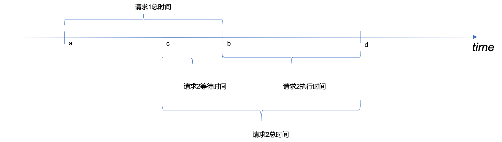

# 史诗级分布式高并发java超时调优案例2
<p style="text-align:right"><span style="font-size: medium; ">-- 西门幽月</span></p>

### 序章

在[案例1](../史诗级java低时延调优案例1/案例1.md)中，作者介绍了解决复杂问题的思路。但真实环境下排查超时问题是非常困难的，尤其在没有有力工具的情况下甚至是不可完成的任务。比如下列超时的排查，都非常困难。

* 偏向锁撤销操作耗时过长

* netty使用错误，在非阻塞io线程组中处理可能会阻塞的业务

* redis所在机器性能差

  > 由于skywalking没有监控jedis的connect,select,close函数，因此这个问题非常不容易发现。有趣的是，如果工程师喜欢使用缓存优化超时问题，那他在这个场景下是永远无法成功了。

* gc导致超时，但gc不佳的原因多种多样，经常需要分析内存快照。

  > 根据gc日志或者业务日志时间戳都可以判断是否有gc发生

* http1.1队头阻塞

  > 如果没有良好的监控方式，则通过详细的日志排查此问题

* 线程池任务因为排队而阻塞

  > 如果是hystrix，可以使用hystrix dashboard查看实时情况

* 部分线程长时间无法得到cpu时间片

  > 可以关注cpu load值，load不高时一般不会有此问题。如果是因为线程太多导致的这种情况，那么喜欢使用多线程优化超时问题的工程师将会使情况变得更糟糕。

* 代理性能或者配置问题，比如nginx

  > 尽量避免使用nginx作为服务注册和发现的工具

以上只是冰山一角，导致超时的情况真是太多而无法穷举。本文将讲述前三种情形。

### 第一章 超时问题再现

在[案例1](../史诗级java低时延调优案例1/案例1.md)中我们解决了由于c3p0配置错误导致老年代内存增长过快，cms垃圾回收耗时较长的问题。此后继续监测服务运行。仍然发现了同样的情况。


首先简单介绍下AB通信机制，A使用HttpClient处理请求，B使用netty作为http服务器处理请求。上图中A项目调用B项目后，B项目却没有立即开始处理。导致这种情况的原因有很多，但是因为有了案例1的经验。我们可以优先考虑下述情况

* B中出现了stop the world？

  由于gc问题已经解决了，因此我们将重点关注其他jvm操作引起的超时。

  > 以gc为例，gc时会发生stop the world。这需要所有的线程都到达safepoint。同样的，撤销偏向锁，debug模式也都需要线程达到safepoint。

  添加以下jvm参数。

  * -XX:+SafepointTimeout

    开启safepoint超时

  * -XX:SafepointTimeoutDelay=500

    如果进入safepoint超过500ms，会打印超时线程名称，不会打印堆栈。相关日志会输出至stdout

    > 如果没有打印线程名称，作者猜测有可能导致超时的不是java线程，参考[SafepointTimeoutDelay not work](https://stackoverflow.com/questions/55373991/jvm-options-xxsafepointtimeout-xxsafepointtimeoutdelay-look-dont-work)

  * -XX:+PrintSafepointStatistics

    打印是什么操作需要使线程进入safepoint，相关日志会输出至stdout

  * -XX:PrintSafepointStatisticsCount=1

    设置打印安全点统计信息的次数

  * -XX:+PrintGCApplicationStoppedTime

    在gc日志中打印应用停止时间

  * -XX:+PrintGCTimeStamps

    gc日志打印程序启动的时间，便于排查问题。因为safepoint日志打印的也是程序启动时间，而不是日期。

* 其他情况

  netty，httpclient，hystrix等都有可能因排队造成超时，[案例1](../史诗级java低时延调优案例1/案例1.md)介绍了为何会发生排队的情况，此处不再赘述

### 第二章  日志不规范扰乱排查节奏

添加了safepoint相关的日志。但是在排查问题的时候，却只能查到部分日志。先说结论，这个问题是由于运维脚本将stdout重定向到logback按天滚动的日志引起。下面我们详述此问题。

* 滚动策略如下

```xml
<rollingPolicy class="ch.qos.logback.core.rolling.TimeBasedRollingPolicy">
  <fileNamePattern>server.%d{yyyy-MM-dd}.log</fileNamePattern>
  <maxHistory>15</maxHistory>
</rollingPolicy>
```

* 假设服务于2020年6月10日8点重启。此时服务器上有如下日志。

  * ...

    省略7号及以前的日志名

  * server.2020-06-08.log

  * server.2020-06-09.log

  * server.log

    logback的滚动策略，当天日志名不含时间戳

* 运维脚本命令

  > java xxx >server.log

  这个命令将stdout重定向到由logback控制的server.log

* 6月11日 0时0分0秒

  此时logback会将server.log重命名为server.2020-06-10.log，并新建一个名称为server.log的日志。此后stdout将会向server.2020-06-10.log输出而不是server.log输出。

**命令行中的stdout重定向，最终的输出目标锁定的是文件而不是文件名**

关于此问题，线上可定制如下规范。

* 线上尽量避免向stdout输出日志

  * 不使用System.out输出日志
  * 各种日志框架不允许配置stdout的输出

  由于jvm本身可能会向stdout输出日志，因此不能避免stdout的使用

* stdout日志单独输出

  一般stdout日志量不大，可以采用追加写入策略，或者采用包含启动时间戳的方式命名stdout输出文件


> 更深入的思考：
> 关于日志的管理，是非常推荐有一套强制的规范的。这比代码规范实行起来更加简单，且效益更高。据说部分工程师自从管理好他们的日志之后，再也没有996了。

### 第三章 偏向锁导致超时

根据发生超时的时间，锁定如下日志

* gc日志

  > 2020-07-22T21:57:23.823+0800: 108030.714: Total time for which application threads were stopped: 1.5431630 seconds, Stopping threads took: 0.0002567 seconds

* safepoint日志

  >     vmop          [threads: total initially_running wait_to_block]  [time: spin block sync cleanup vmop] page_trap_count
  >
  >     108029.172: RevokeBias            [   701     0       3  ]   [   0   0   0 1542   0  ] 0  

gc日志显示停顿1543ms，safepoint日志显示RevokeBias，即撤销偏向锁的cleanup操作耗时1542ms。

> 由于没有在日志中发现导致进入safepoint超时的线程，猜测是jvm内部的一些逻辑耗时，因此没有涉及到java线程。

根据下面的日志，可以看出，应用有679个线程，撤销偏向锁很规律的4s一次，6s一次。


* 为什么是这样的规律呢？

  由于没有详细的日志或工具，不好解答此问题。

关于偏向锁的一些细节不在此赘述。以下引用oracle网站中的一段[Biased locking](https://www.oracle.com/java/technologies/javase/6performance.html#2.1.1)

> Locking attempts by threads other that the one toward which the object is "biased" will cause a relatively expensive operation whereby the bias is revoked. The benefit of the elimination of atomic operations must exceed the penalty of revocation for this optimization to be profitable.
>
> 除对象“偏向”对象以外的其他线程进行的锁定尝试将导致取消偏向锁这样相对昂贵的操作，从而。 消除原子操作的好处必须超过撤销的代价，此优化才能盈利。

在作者的服务中，保持响应的稳定和低时延更为重要。而偏向锁撤销这一操作偶尔会导致高达1500+ms的stop the world，因此作者添加如下jvm参数，禁用了偏向锁。

> -XX:-UseBiasedLocking

### 第四章 netty worker线程阻塞导致超时

禁用偏向锁后，仍然会有这种情况


* B中netty处理请求发生了排队？

  作者本次重点排查netty服务的问题，理由如下：

  > 通过查看代码，b服务使用bossGroup，workerGroup两个线程池。workerGroup线程读取数据后直接处理业务，线程数通过下述方式计算。
  >
  > ```java
  > private int workerThreadSize = Runtime.getRuntime().availableProcessors() * 2 - 1;
  > ```
  >
  > 服务器有高达48的逻辑核，则workerThreadSize为95。其实排队的概率不大。但是workerGroup线程处理有可能阻塞的业务代码是明显的低性能编码。正确的方式应该是有单独的业务线程组异步处理业务，workerGroup只负责非阻塞读写数据，不应该执行任何阻塞代码。

* 解决此问题的方式是？

  出于以下的考虑，作者没有选择先修改，后验证的方式。

  * 单凭猜测去解决问题是草率的，作者想找到确切的证据表明workerGroup阻塞引起了超时，才进行修改，这非常有挑战性。
  * 线上服务比较稳定，修改底层代码需要谨慎。

* 其他情况

  httpclient，hystrix等都有可能因排队造成超时，[案例1](../史诗级java低时延调优案例1/案例1.md)介绍了为何会发生排队的情况，此处不再赘述

A是通过nginx代理调用B的，这种情况下，我们还需要排除nginx出现问题的可能性。

> 作者查看日志不方便，主要体现在
>
> * 4个nginx节点，日志没有使用elk收集
> * nginx由运维维护，作者没有权限，需要运维协助

通过skywalking可以确定，A服务调用2004ms后超时，800ms后，B使用7ms就处理完毕。根据入参搜到nginx访问日志如下：

> 2020-07-24T08:48:56+08:00	10.18.74.85	1595551736.055	GET /api/news/batch/getProfileInfo.go?ids=468788592%2C468735930%2C468777019%2C468739004 HTTP/1.1	499	0	Apache-HttpClient/4.5.1 (Java/1.8.0_121)	-	-	2.003	0

通过此日志可以发现。

* nginx耗时2003ms，这与A的耗时吻合
* 状态码499是nginx对http状态码的扩展，表示客户端关闭了连接。这和A因为Hystrix设置的2s超时吻合。

通过这个日志基本可以断定，nginx是立刻接到A的请求并进行了处理。再看B的日志。根据netty eventloop机制，应该搜索超时请求对应线程的日志。


根据以上日志，其实就破案了。下面我们来根据时间线阐述本次超时请求的细节。

* 2020-07-24 08:48:53.227，B收到一个请求X进行处理
* 2020-07-24 08:48:54.052，A通过Httpclient发起请求
* 2020-07-24 08:48:54.052之后的瞬间，nginx接收到A请求反向代理至B，B服务bossGroup线程建立连接后将此请求绑定至线程[workerGroupThread-3-37]处理。此时nginx发过来的数据会存储至tcp缓冲区。[workerGroupThread-3-37]仍在处理X请求。
* 2020-07-24 08:48:56.056，A服务Hystrix由于2000ms超时关闭连接，nginx发现客户端关闭连接，结束请求，记录状态码499。
* 2020-07-24 08:48:56.720，B处理请求X结束，共耗时3493ms
* 2020-07-24 08:48:56.722-2020-07-24 08:48:56.802，线程[workerGroupThread-3-37]从tcp缓冲区取出某一Y请求数据并处理，耗时80ms
* 2020-07-24 08:48:56.803-2020-07-24 08:48:56.807，线程[workerGroupThread-3-37]从tcp缓冲区取出作者关注的Z请求数据并处理，耗时4ms

下面我们从理论角度来进一步说明此事。nginx收到请求后立刻和B通信，有以下两种情况：

* 未建立tcp连接

  B通过BossGroup和nginx建立连接，一旦连接建立，nginx就可以向B的tcp缓冲区发送数据。bossGroup将得到的channel注册到WorkGroup中的某一线程。

* 已建立tcp连接

  nginx可以直接想B的tcp缓冲区发送数据。

netty通过轮询机制注册channel到workGroup中的某一线程，workGroup共有95个线程。如果channel数大于95，则必然有一个线程对应多个channel的情况，并且处理多个channel是通过eventloop机制串行处理的。如果我们不增加一个异步线程处理业务逻辑，同一线程中前一个channel业务逻辑的run time增加，**在一定条件下**会导致后续业务的run time增加。下图中请求1的起始时间为a,b;请求2的起始时间为c,d。a,c指服务器接受到第一个字节的时间。

* 请求1处理完成后，请求2才到达，则请求1不会影响到请求2

  

* 请求1处理过程中，请求2到达。

  

  * 请求2的run time增加了b-c。
  * c到b这段时间，请求方发送的数据只能存在tcp缓冲区中。

### 第五章 架构思考

回顾排查过程，最耽误时间的还是nginx那一部分。由于历史原因，公司的微服务解决方案http，由nginx进行代理，实现服务注册与发现功能。其弊端有：

* nginx由运维工程师维护，开发工程师无权限，排查问题效率低下

  作者是没有nginx机器权限，nginx日志也没有通过elk收集。因此查询日志依赖运维。有四个nginx节点，自己查都觉得麻烦，多次让运维帮忙实在不好意思。

* nginx服务注册与发现都是需要人力去做的。

  当下流行的微服务解决方案duboo，spring cloud都是由应用程序自身实现服务注册发现功能。

* 链路中多了nginx这一跳，性能降低。

* 开发工程师对nginx一般都欠缺足够的了解

  开发工程师是否有足够能力去排查nginx相关的问题？即使有能力，是否有精力呢？不合理的架构会导致人力的巨大开销，不得不996了。

### 第六章 总结

综上，超时情况主要有以下三种

* [案例1](../史诗级java低时延调优案例1/案例1.md)中的cms垃圾回收

* 撤销偏向锁
* 在netty的workgroup线程中同步处理了可能会阻塞的业务逻辑

上述三种情况是同时存在的，而它们都导致了同样的现象，下游服务起始处理时间远远落后于上游服务发起请求时间。要想理解这种共性，需要明白上游服务建立连接后，其发送的数据会先写入到自身的tcp缓冲区，再发送到下游服务的tcp缓冲区，而tcp协议工作在操作系统层而不是应用层。无论是垃圾回收，撤销偏向锁引起的stop the world，还是workgroup线程同步处理业务时发生阻塞，这都是应用层的阻塞，而tcp协议仍然在操作系统层正常工作。

### 参考文献


