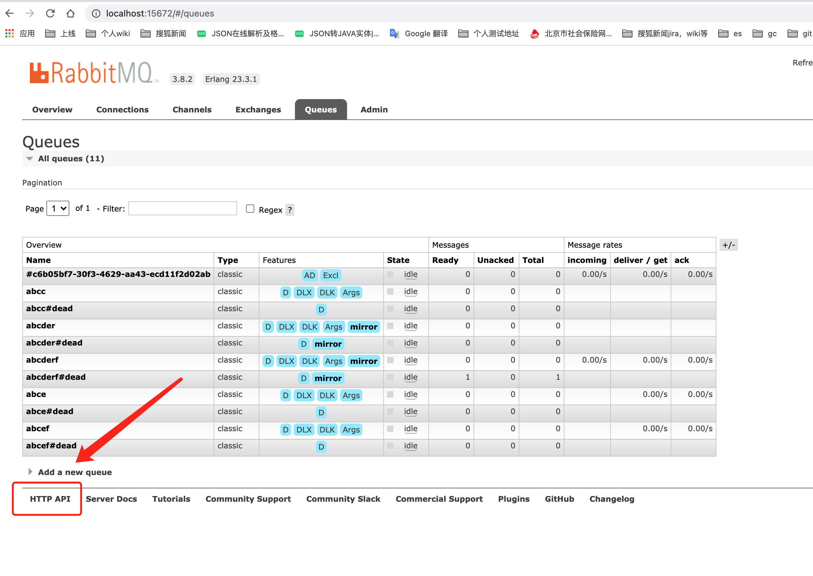

### 基于RabbitMQ的延迟队列服务

近期基于RabbitMQ搭建了一个分布式的延迟队列服务，在网上查到的多种实现方案都有瑕疵，且缺乏细节，甚至常见的方案实际上却存在很大的问题，例如redis过期key监听，RabbitMQ死信队列，非常误导人，因此特地写一篇博客，分享给有需要的朋友。

#### 业务需求

* 订单超时取消

  例如，商城订单15分钟内没有支付就取消，从而释放库存

* 日程提醒

  例如，提醒某人某个时间做什么事

* 定时发送邮件

上述场景有几个共同的特征

* 非周期性
* 在指定的时间触发一次

#### 队列服务的主要要求

* 同一个数据，只有一个节点消费，即无竞争，避免业务代码有锁编程
* 正常情况下，一个数据只消费一次，业务代码不考虑幂等性问题
* 触发时间和配置时间的误差尽可能低

#### 方案对比

* 数据中心 + 轮询方式

  * redis zset，以时间戳作为score，轮询首个member，如果时间戳比当前时间早即触发
  * mysql，建立时间戳b+ tree索引，轮询首个member，如果时间戳比当前时间早即触发

  缺点是：轮询效率较低，精度和轮询的时间间隔有关，并且分布式多个节点同时轮询，可能会取到相同的记录，产生竞争

* [Redis Keyspace Notifications](https://redis.io/topics/notifications)

  网上一般介绍的是过期key监听，根据文档，实际上[Redis Keyspace Notifications](https://redis.io/topics/notifications)也有其他的监听方式：

  * 给定key的所有命令

  * 所有key的lpush命令

  * 所有在database 0中的key过期事件

    过期key的问题其实很大，Redis 以两种方式使具有生存时间关联的键过期：

    1. 当某个命令访问该key并发现该key已过期时
    2. 通过后台系统逐步查找过期key，以便能够收集从未访问过的key

    因此无法保证Redis服务器能够在该键的存活时间达到零值时生成过期事件。

  Redis pub/sub的缺点文档也写的很清楚，客户端连接断开期间的事件不会在重连后收到，多个连接的客户端会收到相同的事件，从而产生竞争。

* Apache RocketMQ定时消息

  > broker有配置项messageDelayLevel，默认值为“1s 5s 10s 30s 1m 2m 3m 4m 5m 6m 7m 8m 9m 10m 20m 30m 1h 2h”，18个level。可以配置自定义messageDelayLevel。注意，messageDelayLevel是broker的属性，不属于某个topic。发消息时，设置delayLevel等级即可：msg.setDelayLevel(level)

  根据上述官方文档，可以看出其精度是有18种粒度，如果想要实现随意的粒度，需要在中间件层面解决粒度的问题。

* RabbitMQ 过期消息+死信队列

  > 以下来自官方文档
  >
  > Queues that had a per-message TTL applied to them retroactively (when they already had messages) will discard the messages when specific events occur. Only when expired messages reach the head of a queue will they actually be discarded (or dead-lettered). 

  上述文档表示，仅当消息到达队列头部时，消息才会被发送到死信队列，这样会导致非常严重的问题。比如，如果首先发布了一个延迟20秒到期的任务A，又发布了延迟5秒到期的任务B，那么B任务最钟延迟时间为20s！有人为了解决此问题为不同的延迟消息创建不同的队列，这和RocketMQ的实现一样。

* [RabbitMQ延迟消息插件](https://github.com/RabbitMQ/RabbitMQ-delayed-message-exchange)

  最终选择了这个来实现，其主要原理为，server端将延迟的消息写入到Mnesia table，并通过erlang计时器在延迟时间到达时发送到对应的队列。官方的介绍是，当前插件为实验特性，但非常稳定可用于生产环境。但其延迟时间限制为0-2^32-1毫秒。

  >以下来自官方文档
  >
  >This plugin is considered to be **experimental yet fairly stable and potential suitable for production use as long as the user is aware of its limitations**.
  >
  >For each message that crosses an `"x-delayed-message"` exchange, the plugin will try to determine if the message has to be expired by making sure the delay is within range, ie: `Delay > 0, Delay =< ?ERL_MAX_T` (In Erlang a timer can be set up to (2^32)-1 milliseconds in the future).

#### 创建队列

这个在[RabbitMQ延迟消息插件](https://github.com/RabbitMQ/RabbitMQ-delayed-message-exchange)的文档中有介绍，不必赘述

#### RabbitMQ 发布者确认机制

> Using standard AMQP 0-9-1, the only way to guarantee that a message isn't lost is by using transactions -- make the channel transactional then for each message or set of messages publish, commit. In this case, transactions are unnecessarily heavyweight and decrease throughput by a factor of 250. To remedy this, a confirmation mechanism was introduced. It mimics the consumer acknowledgements mechanism already present in the protocol.

RabbitMQ可以使用事务或者发布者确认机制保证消息的可靠性，前者比后者的吞吐量下降了250倍。使用spring-rabbit集成时，应考虑该种方式。

#### 消费

消费是实现延迟队列服务非常重要的一个环节，但是却鲜有人提。如何保证消息尽可能不积压？一旦消息积压，延迟任务的时间精度就会变差。保证消息不积压，首先想到的是使用多个消费者提高消费能力。

以spring集成RabbitMQ为例

* 如果使用SimpleMessageListenerContainer，则可以使用setConcurrency设置并发数
* 如果使用DirectMessageListenerContainer，则可以使用setConsumersPerQueue设置并发数

但是这是有问题的，一般消费者还会有一个prefetchCount属性，这个是指一次拉取消息的数目，spring默认是250。因此假设当前有2000条消息，10个消费者，可能有4个消费者各自获取了250条消息，而其他消费者则没有获取到消息。由于网络IO一般是比较耗时的操作，因此prefetchCount也不应当设置为较小的值。

因此正确的做法是使用少量的消费者，如果负载不高，一个分布式节点有一个消费者就够了，消费者消费消息则使用线程池异步去做。

#### 提供SDK VS 提供http服务

由于集成RabbitMQ，并保证消息的及时触发要考虑上述很多细节。因此有必要将上述逻辑的复杂性掩藏，对外提供一个SDK。但使用SDK时，业务开发仍需要关注一些必需的配置和代码，如线程池参数，RabbitMQ消费者确认等。因此作者更倾向于使用该SDK再次包装成一个http服务，并暴露如下接口。

* 创建队列，参数元数据可以在RabbitMQ的队列声明时添加
  * delayQueueName 延迟队列名称
  * messageCallbackUrl 消息回调接口
  * confirmCallbackUrl 消息确认接口
* 发送消息
  * delayQueueName 延迟队列名称
  * message 消息
  * confirmId 确认id
  * delayTimeInMs 延迟时间

笔者使用线程池异步回调，使用Apache HttpClient发起http请求，需要注意client的maxConnPerRoute属性，该参数用于解决http队头阻塞问题，任何的阻塞都会影响到消息触发时间的精度。

#### 提供http服务的难点

注意到http服务隐藏了更多的细节，因此实现起来则更为复杂。

* 初始化消费者

  服务启动时，使用RabbitMQ提供的rest的接口，查到所有延迟队列，进行监听

* 动态创建队列

  动态创建队列需要通知到其他所有的消费者添加该队列的监听，因此需要创建一个广播的exchange，所有节点声明一个独占的queue并binding到该exchange进行监听。

* 查询队列元数据信息

  使用RabbitMQ提供的rest接口，查询queue的元数据信息，如创建时配置的回调接口。

之所以使用到了rest接口，因为这里要查询的信息，不在amqp协议内，因此没有相应的api。rest接口文档可在admin中查看。

#### 缺点

* 由于每个数据仅在一个节点保存，因此需要底层存储提供备份
* 节点宕机会导致数据触发不及时，必须尽快拉起

如果上述缺点无法接受的话，可以考虑RocketMQ